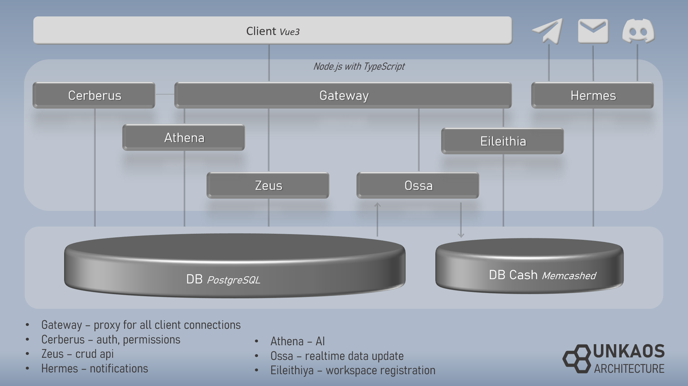

# 
<div align="center">


[](LICENSE) 
[](https://t.me/unkaos_info)
</div>

## Ваш трекер задач с открытым исходным кодом

**Unkaos** - это мощный бесплатный трекер задач, вдохновленный функциональностью классических систем, таких как Jira и YouTrack, созданный в первую очередь для команд разработки, но не только. Наслаждайтесь надежным инструментом управления проектами с гибкой настройкой, доступным под лицензией Apache 2.

🌐 Официальная облачная версия: [http://unkaos.org](http://unkaos.org) | 📦 Установите на свой сервер: [Инструкция по установке](#📦standalone-setup)


Построенный на современном технологическом стеке - Vue.js 3, Node.js, TypeScript и PostgreSQL, он обеспечивает комфортную работу, включая обновления задачи в реальном времени с помощью WebSockets и даже искусственный интеллект для понимания запросов пользователей на естественном языке.

## 📖 Содержание

[#📚Руководство пользователя](#📚Руководство-пользователя)
    - [🧑‍💻Для участников команды](#🧑‍💻Для-участников-команды)
      - [Задачи](#Задачи)
        - [Поиск задач](#Поиск-задач)
        - [Создание задач](#Создание-задач)
        - [Работа с задачей](#Работа-с-задачей)
        - [Массовые изменения и другие функции искусственного интеллекта](#Массовые-изменения-и-другие-функции-искусственного-интеллекта)
      - [Agile доски](#Agile-доски)
        - [Использование доски](#Использование-доски)
        - [Создание и настройка вашей доски](#Создание-и-настройка-вашей-доски)
      - [Панели](#Панели)
        - [Обзор панели](#Обзор-панели)
        - [Список задач](#Список-задач)
        - [Отчеты по времени](#Отчеты-по-времени)
        - [Диаграммы сгорания](#Диаграммы-сгорания)
      - [Персональные настройки](#Персональные-настройки)
    - [🛠️Для администраторов рабочего пространства](#🛠️Для-администраторов-рабочего-пространства)
      - [Настройки рабочего пространства](#Настройки-рабочего-пространства)
      - [Настройка процессов](#Настройка-процессов)
      - [Пользователи и роли](#Пользователи-и-роли)
    - [📦Независимая настройка](#📦Независимая-настройка)
      - [Установка](#Установка)
      - [Настройки сервера](#Настройки-сервера)
[#💻Документация разработчика](#💻Документация-разработчика)
    - [Архитектура](#Архитектура)
    - [Содействие](#Содействие)
    - [Справочник API (в процессе)](#Справочник-API-(в-процессе))
[#📢Информация](#📢Информация)


# 📚Руководство пользователя

## 🧑‍💻Для участников команды
Если вас пригласили присоединиться к существующему проекту, вы должны связаться с вашим администратором. Он добавят вас в рабочее пространство, и вы получите письмо со ссылкой для входа и временным паролем, который вы сможете изменить в настройках вашего пользователя.

### Задачи

#### Поиск задач

Для поиска задач вы можете использовать поле поиска на странице "Задачи". Это поле предлагает доступные варианты на каждом этапе конструирования вашего запроса. Синтаксис подобен SQL, где каждый запрос состоит из фильтров: каждый фильтр начинается с имени поля задачи, за которым следует оператор, а затем значение. Фильтры могут быть смешаны и группированы логическими операторами.

Когда искомое значение является строкой не из списка доступных значений, заключите его в кавычки (' '). Даты должны иметь формат 'гггг-мм-дд', например '2016-07-16'.

Если вы не уверены в правильной структуре запроса или предпочитаете не писать его таким образом, не волнуйтесь. Искусственный интеллект Unkaos будет интерпретировать любой запрос, чтобы понять, что вы ищете, и сгенерирует соответствующий запрос для вас.


#### Создание задач

Чтобы создать задачу, используйте кнопку, расположенную рядом с вашим профилем в правом верхнем углу. Как и профиль, эта кнопка доступна с любой страницы.

Кроме того, когда вы находитесь на странице задачи, вы можете создать новую, используя кнопку клонирования в верхнем меню или используя кнопку создания подзадачи рядом с ней.

Некоторые конфигурации Agile-досок позволяют быстро и просто создавать новые задачи прямо из столбца доски, используя кнопку '+'.

#### Работа с задачей

Чтобы редактировать задачу, нажмите на иконку ручки в верхнем меню. После этого, находясь в режиме редактирования, вы можете изменить название, описание или проект. Обратите внимание, что изменение проекта приведет к изменению номера задачи из-за ее структуры, которая включает короткое название проекта. Не забудьте использовать кнопку сохранения или нажать Ctrl+S после внесения изменений в режиме редактирования. Другие поля, которые находятся в правой панели, можно редактировать в любом режиме, и изменения применяются сразу после перехода фокуса с поля.

Описание в режиме редактирования предоставляется как текстовое поле для редактирования с использованием Markdown и предварительным просмотром. Используйте стандартное руководство по Markdown, если хотите лучше ознакомиться с вашими вариантами. Не стесняйтесь вставлять изображения прямо в редактируемое поле описания.

Если вы хотите, чтобы изображение было доступно в задаче, но не встроено в описание, добавьте его в раздел вложений. Там вы можете прикрепить любые файлы к вашей задаче.

Переходы состояний задач доступны только в соответствии с соответствующим рабочим процессом.

Кнопка с иконкой глаза в верхнем меню позволяет следить за задачей - это означает, что вы будете уведомлены обо всех изменениях по электронной почте или через мессенджеры.

Кроме того, вы можете управлять связями, тегами и использованием времени в задаче.


#### Массовые изменения и другие варианты искусственного интеллекта

Есть кнопка мозга, расположенная в центре снизу. Она открывает панель для запросов искусственного интеллекта (ctrl + alt + a). Вы можете ввести команду на естественном языке, затем нажать кнопку "мозг" или нажать Enter, чтобы получить интерпретацию искусственного интеллекта. Доступны команды для поиска, создания и обновления задач. Также можно получить любые ответы в readme. Будьте осторожны и убедитесь, что оно точно отражает ваш запрос на модификацию команд. Обратите внимание, что эта функция позволяет вам выполнять массовые изменения в Unkaos, и важно убедиться, что они применяются к правильному набору задач.

### Agile-доски

#### Использование доски

Agile-доски предоставляют визуальный обзор прогресса проекта. Перетаскивайте задачи между столбцами для обновления их статуса.

#### Создание и настройка вашей доски

Перейдите в раздел "Доски" и нажмите "Создать новую доску". Выберите макет доски, столбцы и задачи, которые она должна отображать.

### Панели

#### Обзор панели

Панели предоставляют настраиваемый обзор ваших проектов. Вы можете добавлять виджеты, такие как списки задач, отчеты по времени и диаграммы сгорания.

#### Список задач

Виджет списка задач отображает ваши задачи в виде списка с возможностью сортировки и фильтрации по различным критериям.

#### Отчеты по времени

Отчеты по времени отслеживают затраченное время на задачи. Они могут использоваться для получения информации о продуктивности команды и сроках проекта.

#### Диаграммы сгорания

Диаграммы сгорания визуализируют прогресс вашего проекта по срокам, помогая командам оставаться в тренде.

### Персональные настройки

В настройках вашего пользователя вы можете настроить уведомления, обновить свой профиль и изменить пароль. Получите доступ к настройкам из меню пользователя в правом верхнем углу.

## 🛠️Для администраторов рабочего пространства

Как администратор рабочего пространства, у вас есть дополнительные обязанности и возможности в Unkaos.

### Настройки рабочего пространства

Администраторы могут настраивать глобальные настройки, включая структуру проектов, разрешения по умолчанию и интеграции с другими инструментами.

### Настройка процессов

Настройте рабочие процессы, поля задач и роли пользователей под процессы вашей команды. Получите доступ к этим настройкам из административной панели.

### Пользователи и роли

Управляйте учетными записями пользователей и ролями из раздела "Пользователи" в административной панели. Вы можете добавлять новых пользователей, назначать роли и устанавливать разрешения.

## 📦Независимая настройка


### Установка
Установка должна выполняться на машине с чистой ОС, в настоящее время поддерживающей Ubuntu и Debian.

Войдите на машину под пользователем с правами sudo и выполните команду:

```bash
wget -O - https://raw.githubusercontent.com/khvilon/unkaos/master/setup.sh | bash
```

Это выполнит скрипт установки с мастером, который спрашивает ваше доменное имя и пароль от базы данных.

Дополнительно скрипт установит сертификат Certbot для HTTPS, или вы можете пропустить этот шаг, если у вас уже есть.

### Настройки сервера

После установки Unkaos вы должны войти в рабочее пространство 'Server' по следующему URL-адресу:

`https://[ваш.домен]/server/login`

Войдите под учетными данными:
- **Имя пользователя**: `root@unkaos.org`
- **Пароль**: `rootpass`

⚠️ **Важно!!!** В качестве меры безопасности обязательно измените пароль по умолчанию сразу после первого входа. Вы можете сделать это через 'Настройки пользователя' или раздел 'Аккаунт' в платформе Unkaos.

В настройках сервера вы должны в первую очередь установить данные электронной почты для активации регистрации рабочего пространства, обновлений паролей и уведомлений.

Также для пользователя будет полезно запрашивать у ИИ его запросы. Чтобы запустить его, вам нужно настроить интеграцию с сервером GPT, таким как openai API. Можно использовать любой сервер с протоколом openai. Доступен прокси. Также можно добавить вторую более дешевую модель для поиска readme. Обратите внимание, что основная модель должна быть одной из самых сильных на сегодняшний день, таких как openai GPT 4 turbo.

Автообновление в ночное время включено по умолчанию, оно будет искать последнюю стабильную версию из основной ветки репозитория. Вы можете отключить его или изменить разрешенные часы.


# 💻Документация разработчика

## Архитектура

Unkaos построен на прочном, масштабируемом и современном стеке технологий, разработанных для эффективности и удобства использования. В центре Unkaos используется Vue.js 3 для фронт-энда, обеспечивая реактивный и компонуемый пользовательский интерфейс. Бэк-энд основан на Node.js, обеспечивая быструю и масштабируемую серверную логику. Хранение данных управляется PostgreSQL, известной своей надежностью и мощными возможностями.

Структура базы данных позволяет пользователям получать доступ к данным своего рабочего пространства, обеспечивая при этом безопасную изоляцию других рабочих пространств - каждое рабочее пространство представлено схемой в базе данных PostgreSQL.



### Ключевые сервисы:

Первый сервис, к которому обращается любой запрос от клиента, - это Шлюз. Он не имеет много функционала, работает как прокси, проверяя права пользователя в сервисе Cerberus и подключаясь к необходимому сервису в локальной сети сервера.

Бэк-энд-сервисы названы в соответствии с греческой мифологией:

Зевс - король олимпийских богов, также известный как отец богов. Здесь Зевс является основным и крупнейшим сервисом, обеспечивающим полный CRUD API для всех объектов в базе данных. У него есть возможность автоматически устанавливать методы CRUD для новых таблиц, объявленных с их отношениями в базе данных.

Гермес - бог-вестник богов, в Unkaos назван службой уведомлений, используемой для отправки сообщений по электронной почте, Telegram и Discord. Боты для Telegram и Discord нужно создавать вручную, а затем токен сохраняется в конфигурациях сервера администратором сервера.

Афина - богиня мудрости, представляет собой службу искусственного интеллекта. Она получает запросы пользователей, сначала через API-интеграцию с сервером GPT, она пытается классифицировать запрос, а затем использует сервер GPT для выдачи информации или выполнения команды пользователя.


## Содействие

Unkaos открыт для вклада сообщества. Помогите улучшить проект, создавая запросы на извлечение, сообщая об ошибках или обсуждая новые функции в Issues.

### Зависимости

Unkaos строится с использованием ряда важных инструментов и библиотек:

- [Vue.js 3](https://v3.vuejs.org/)
- [Node.js](https://nodejs.org/)
- [TypeScript](https://www.typescriptlang.org/)
- [PostgreSQL](https://www.postgresql.org/)

## 📢Информация

Оставайтесь в курсе новостей проекта с телеграм каналом. В случае необходимости свяжитесь с автором.

🔔News: [https://t.me/unkaos_info](https://t.me/unkaos_info)
<br>
📧 Contact: n@khvilon.ru | [@khvilon](https://t.me/khvilon)

